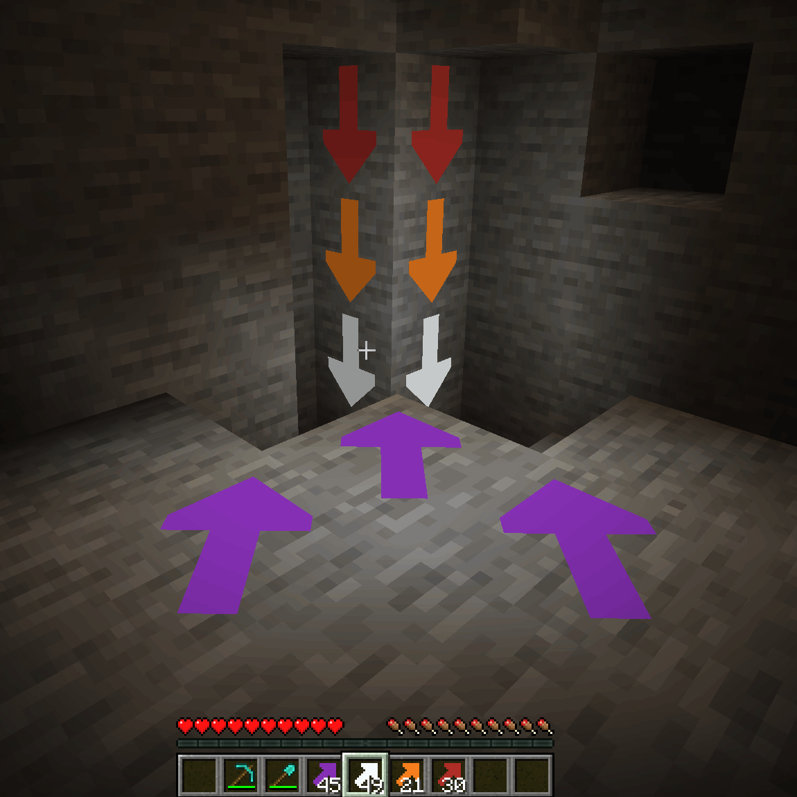

# Color Pointers (Fabric)

**Allows you to place high contrast arrow pointers on any full block to aid you on your mining journeys. Never lose your way again.**

Hitting the corner of a block places an arrow pointing in that direction, hitting the center creates an X.  
The placed arrows emit a faint light, and they are visible even in the dark.  

## License

Standard MIT license. Feel free to learn from it and incorporate it in your own projects.

## Source code

Available on [GitLab](https://gitlab.com/pintergabor/colorpointers.git) or [GitHub](https://github.com/pinter-gabor-at/colorpointers.git)

## For developers

Quite often, when I start learning programming on a new platform, I find even the simplest examples too complicated.
Tutorials, written by experts, with years of experience programming on that platform, sometimes forget how difficult those first step are.  
This is why I decided to make my first Minecraft mods publicly available.

## Requires  
- [Fabric API](https://modrinth.com/mod/fabric-api)

## Recommended addons

[Iron Signs](https://modrinth.com/mod/ironsigns) is a good companion mod to place matching color signs next to the arrows.  

## Alternative addons

[Arrow Pointers](https://modrinth.com/mod/arrow-pointers) allows you to mark your way with vanilla arrows.  
[Chalk](https://modrinth.com/mod/chalk) provides a different way to mark your path with arrows.  
And [Chalk: Colorful Addon](https://modrinth.com/mod/chalk-colorful-addon) adds variants of chalk in every color!

